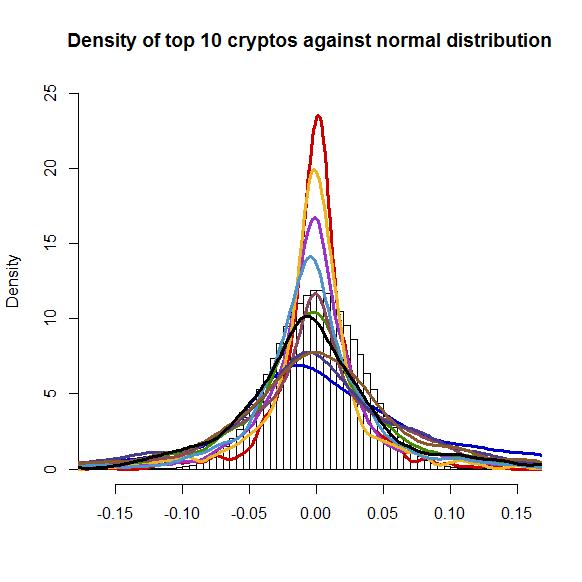

[](http://quantlet.de/index.php?p=info)

## [](http://quantlet.de/) **CCSHistReturnsDensity** [](http://quantlet.de/d3/ia)

```yaml

Name of Quantlet : CCSHistReturnsDensity

Published in : The Cross Section of Crypto-Currencies as Financial Asset

Description : 'Compares the densities of the top 10 crypto-currencies by market capitalization
against a histogram of the normal distribution.'

Keywords : histogram, Crypto-Currencies, density, normal distribution, plot

See also : 'CCSAlphas, CCSCryptoSurvival, CCSecdf, CCSHistMarketCap, CCSHistMarketCapHighValAreas,
CCSMarketCapvsVol, CCSMeansRollingWindow, CCSPCAExVar, CCSSdRollingWindow'

Author : Simon Trimborn, Hermann Elendner

Submitted : Fri, September 16 2016 by Simon Trimborn

Datafile : data.RData

Example : 'A plot giving the densities of the top 10 crypto-currencies by market capitalization
plotted against a histogram of the normal distribution with the same parameters than Bitcoin.'

```




### R Code:
```r
rm(list=ls(all=TRUE))

# please change your working directory
#setwd("C:/...")

library(xts)
load("data.RData")

hist(rnorm(1000000, mean = mean(crypto_returns_selec_xts[, 1]), 
    sd = sd(crypto_returns_selec_xts[,1])), freq = FALSE, breaks = 100,
    ylim = c(0,25), main = "Density of top 10 cryptos against normal distribution", 
    xlab = "")
for (i in 1:length(max_cryptos)) {
    lines(density(na.omit(crypto_returns_selec_xts[,i])), col = color[i], lwd = 3)
}
```
