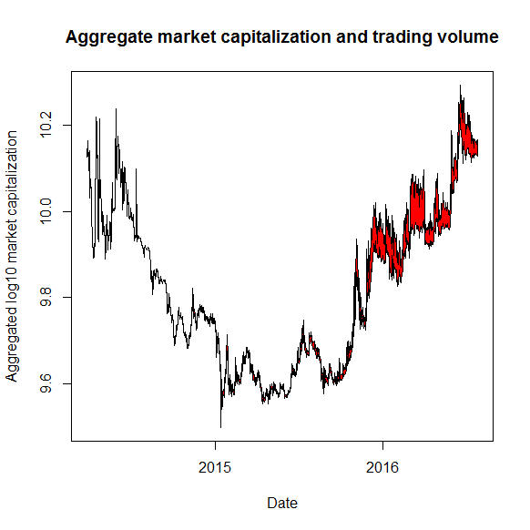

[](http://quantlet.de/index.php?p=info)

## [](http://quantlet.de/) **CCSMarketCapvsVol** [](http://quantlet.de/d3/ia)

```yaml

Name of Quantlet : CCSMarketCapvsVol

Published in : The Cross Section of Crypto-Currencies as Financial Asset

Description : 'Plots the aggregate market capitalization of all crypto-currencies while the
thickness of the line gives the corresponding trading volume.'

Keywords : trading volume, Crypto-Currencies, log, normal distribution, plot

See also : 'CCSAlphas, CCSCryptoSurvival, CCSecdf, CCSHistMarketCap, CCSHistMarketCapHighValAreas,
CCSHistReturnsDensity, CCSMeansRollingWindow, CCSPCAExVar, CCSSdRollingWindow'

Author : Simon Trimborn, Hermann Elendner

Submitted : Fri, September 16 2016 by Simon Trimborn

Datafile : data.RData

Example : 'A plot giving the aggregate market capitalization of all crypto-currencies while the
thickness of the line gives the corresponding trading volume.'

```




### R Code:
```r
rm(list=ls(all=TRUE))

# please change your working directory
#setwd("C:/...")

library(xts)
load("data.RData")

FancyPlotFunction = function(market, volume) {
    cum_volume = apply(volume, 1, sum, na.rm = T)
    cum_market = apply(market, 1, sum, na.rm = T)
    cum_volmarket_minus = log10((cum_volume - cum_volume/2) + cum_market)
    cum_volmarket_plus = log10((cum_volume + cum_volume/2) + cum_market)
    
    plot(x=index(market), y = cum_volmarket_plus, 
         type = "l", ylab = "Aggregated log10 market capitalization", xlab = "Date", 
         main = "Aggregate market capitalization and trading volume", 
         ylim = c(min(cum_volmarket_plus, cum_volmarket_minus), max(cum_volmarket_plus, cum_volmarket_minus)))
    polygon(c(index(market), rev(index(market))), c(cum_volmarket_minus, rev(cum_volmarket_plus)), col = "red")
}

FancyPlotFunction(crypto_market_xts, crypto_vol_xts)

```
