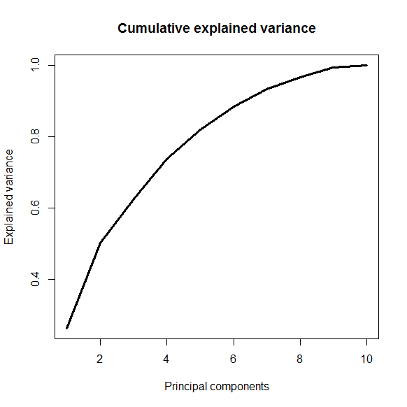

[](http://quantlet.de/index.php?p=info)

## [](http://quantlet.de/) **CCSPCAExVar** [](http://quantlet.de/d3/ia)

```yaml

Name of Quantlet : CCSPCAExVar

Published in : The Cross Section of Crypto-Currencies as Financial Asset

Description : 'Plots the cumulative explained variance by the principal components of a PCA of the
top 10 crypto-currencies by market capitalization.'

Keywords : PCA, Crypto-Currencies, explained variance, returns, plot

See also : 'CCSAlphas, CCSCryptoSurvival, CCSecdf, CCSHistMarketCap, CCSHistMarketCapHighValAreas,
CCSHistReturnsDensity, CCSMarketCapvsVol, CCSMeansRollingWindow, CCSSdRollingWindow'

Author : Simon Trimborn, Hermann Elendner

Submitted : Fri, September 16 2016 by Simon Trimborn

Datafile : data.RData

Example : 'A plot giving the cumulative explained variance by the principal components of a PCA of
the top 10 crypto-currencies by market capitalization.'

```




### R Code:
```r
rm(list=ls(all=TRUE))

# please change your working directory
#setwd("C:/...")

library(xts)
load("data.RData")

pca = prcomp(na.omit(crypto_returns_selec_xts))
plot(summary(pca)$importance[3,], type = "l", lwd = 3, 
     main = "Cumulative explained variance", xlab = "Principal components", 
     ylab = "Explained variance")

```
